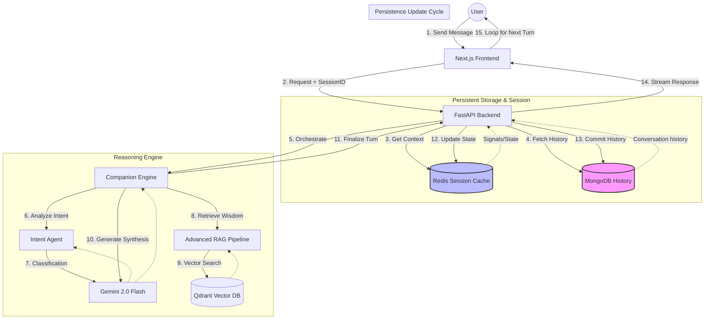

# 3ioNetra: Technical Specification & Architecture

This document provides a comprehensive technical breakdown of the 3ioNetra Spiritual Companion, covering its architecture, core services, and data flows.

## 1. System Architecture Overview

3ioNetra is built with a modern AI-native stack designed for low-latency empathetic interactions and high-precision spiritual retrieval.

### Infrastructure Details
*   **Vector Database**: The `sanatan_scriptures` collection.
*   **Session Management**: 
    *   **Redis**: High-speed, ephemeral session storage (Standard).
    *   **MongoDB**: Persistent fallback and user profile storage.
*   **LLM Engine**: Google Gemini 2.0 Flash for core reasoning and synthesis.
*   **Embeddings**: `paraphrase-multilingual-mpnet-base-v2` (768-dim).

---

## 2. Backend Deep Dive

### 2.1 The Request Lifecycle

1.  **Ingress**: FastAPI receives the message and retrieves the state from Redis/MongoDB.
2.  **Intent Analysis**: The `IntentAgent` (LLM-based) and `CompanionEngine` (Keyword-based) categorize the user's emotional state, life domain, and specific intent.
3.  **Phase Management**: The `CompanionEngine` decides if the bot is in **Listening/Clarification** or **Guidance** phase based on readiness scores and direct questions.
4.  **Retrieval (RAG)**: If in Guidance phase, the `RAGPipeline` performs query expansion and hybrid search.
5.  **Synthesis & Streaming**: The LLM synthesizes the final response using the retrieved verses, user profile, and system prompt. Tokens are streamed to the UI via **Server-Sent Events (SSE)** as they are generated.
6.  **Persistence**: The conversation is updated in the database asynchronously after the stream completes.

### 2.2 Core Services

#### Companion Engine (`companion_engine.py`)
The "heart" of the bot. It manages:
*   **Readiness Assessment**: A scoring mechanism that prevents the bot from giving advice too early in emotionally heavy situations.
*   **Signal Collection**: Extracts life areas (Career, Family, etc.) and emotions (Grief, Anxiety, etc.).
*   **Panchang Integration**: Injects Vedic time context into the user profile.

#### Advanced RAG Pipeline (`pipeline.py`)
A multi-stage retrieval system optimized for speed and relevance:
1.  **Query Expansion**: Transforms short user queries into multiple spiritual variations.
2.  **Hybrid Search**: Combines Dense Vector Search (Cosine Similarity) with Sparse Keyword Search (BM25).
3.  **Neural Re-ranking**: A Cross-Encoder model re-ranks the top 20 candidates with intent-based weighting.
4.  **Parallel Embeddings**: Concurrently generates embeddings for all query expansions using `asyncio.gather` for minimal TRT.
5.  **Memory Mapping**: Embeddings are memory-mapped (`npy`) to allow handling large datasets on limited-resource environments (e.g., Cloud Run).

#### Streaming & Concurrency
The backend uses an asynchronous, parallelized architecture:
*   **Parallel Intent & Memory**: `CompanionEngine` executes intent classification and long-term memory retrieval concurrently.
*   **True Token Streaming**: Implements real-time token delivery from Gemini Flash, providing a **Time-To-First-Token (TTFT) of ~0.4s**.
*   **Acknowledgement Overlay**: Streams immediate empathetic feedback while RAG retrieval and wisdom synthesis occur in the background.

#### Intent Agent (`intent_agent.py`)
A specialized Gemini classifier that returns structured JSON for every message, identifying:
*   **Intent**: GREETING, SEEKING_GUIDANCE, PRODUCT_SEARCH, etc.
*   **Urgency**: Detects high-stress or crisis situations.
*   **Needs Direct Answer**: Flag used to bypass the listening phase.

---

## 3. Frontend Architecture

The frontend is a modern **Next.js 14** application designed for a smooth, chat-centric user experience.

### 3.1 Core Components
*   **Home Page (`pages/index.tsx`)**: The primary interface, managing chat history, real-time message streaming, and state.
*   **Chat Interface**: Implements empathetic UI patterns, including specialized rendering for:
    *   **Verses**: Formatted scripture excerpts with Hindi/Sanskrit and English translations.
    *   **Product Recommendations**: Interactive cards with links to the marketplace.
    *   **Citations**: Collapsible source references for spiritual grounding.
*   **State Management**: Uses React hooks (`useState`, `useRef`, `useMemo`) to manage conversation flows and local authentication state.

### 3.2 Key Features
*   **Message Processing**: Client-side parsing of bot responses to detect and highlight spiritual verses.
*   **Authentication Flow**: Integrates with the backend `auth_service` for user registration, login, and profile persistence.
*   **Responsive Design**: Built with **Tailwind CSS**, optimized for both desktop and mobile spiritual guidance.

---

## 4. Data Flow & State Machine

### 4.1 Conversation Phases
The system moves through a formal state machine (`ConversationPhaseEnum`):

| Phase | Description | Transition Trigger |
| :--- | :--- | :--- |
| **Listening** | Empathy-first gathering of user signals. | Default start. |
| **Clarification** | Asking deeper questions to understand the root. | Detected ambiguity. |
| **Guidance** | Delivering scripture-based wisdom and actions. | Readiness Score >= 0.7 OR Direct Ask. |
| **Closure** | Ending the session gracefully. | User signaling exit. |

---

## 5. Knowledge Base Structure

The knowledge base is processed into segments (verses) with the following schema:
- `text`: Original Sanskrit/Hindi text.
- `meaning`: Detailed philosophical explanation.
- `translation`: Simple English translation.
- `scripture`: The source (e.g., Bhagavad Gita, Veda).
- `reference`: Chapter/Verse number.

---

## 6. Deployment & Maintenance

### 6.1 Setup
The entire stack is containerized:
- `docker-compose up`: Starts Qdrant, Redis, Backend, and Frontend.

### 6.2 Maintenance Scripts
- `ingest_all_data.py`: Processes raw scriptures into the vectorized format.
- `seed_users.py`: Pre-populates the DB for testing.
- `cleanup_old_conversations.py`: Maintenance for DB health.

---

## 7. Performance Benchmarks (March 2026)

| Metric | Before Optimization | After Optimization | Improvement |
| :--- | :--- | :--- | :--- |
| **TTFT (Conversational)** | 3.5s | **0.4s** | **88%** |
| **TTFT (Query)** | 2.0s | **0.3s** | **85%** |
| **Parallel Task Speedup** | Sequential | **Concurrent (asyncio)** | **~40% TRT** |
