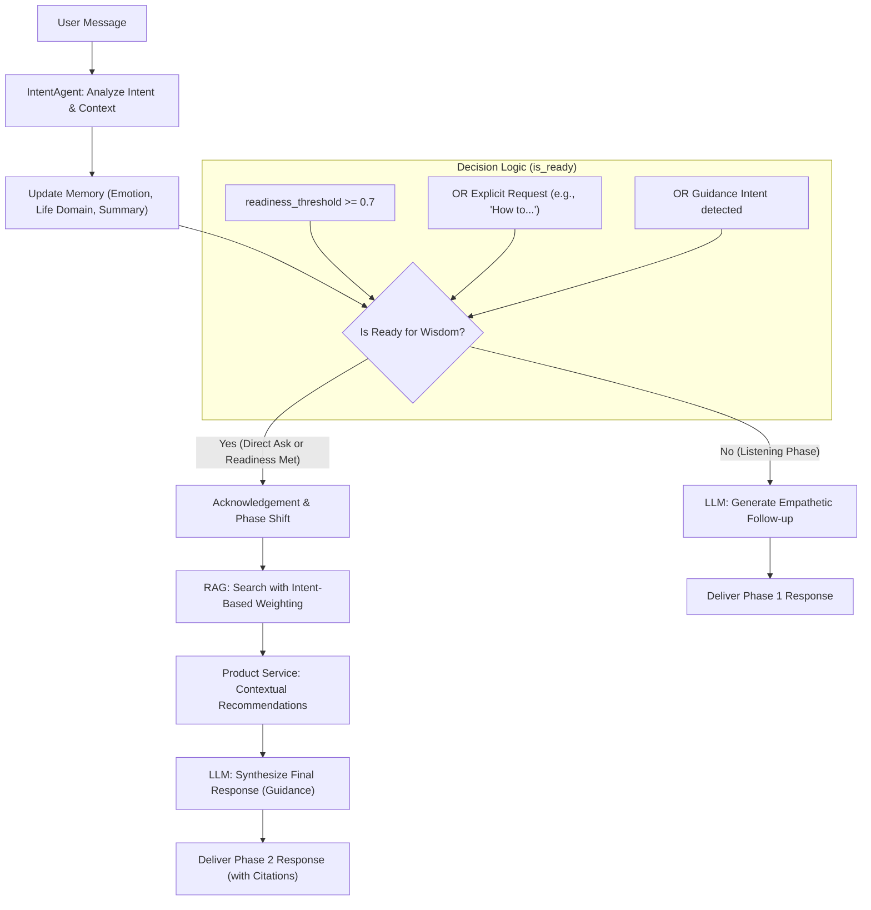

# 3ioNetra: User Flow & Interaction Model

This document illustrates how the Spiritual Companion processes user messages, detects intent, manages conversation phases, and provides dharmic wisdom.

---

## 🔄 Core Interaction Flow

The following Mermaid diagram outlines the logic from initial message to RAG-augmented response.

---

## ❓ Example Questions & Answers (Q&A)

The following scenarios demonstrate how the bot transitions between phases based on user input.

### Scenario 1: Initial Listening (Emotional Intensity)
**User:** "I've been feeling really lost lately, like none of my hard work matters."
**Bot (Phase: LISTENING/CLARIFICATION):**
> "I hear the heaviness in your words. It sounds like you're carrying a significant burden of doubt despite all your efforts. Could you tell me more about what specifically makes you feel that your work has lost its meaning? I’m here to listen."

**Explanation:** The bot detects high emotional intensity and stays in the listening phase to build a deeper "Readiness Score" before offering advice.

---

### Scenario 2: Direct Procedural Request (Instant Guidance)
**User:** "How can I perform a simple puja at home?"
**Bot (Phase: GUIDANCE):**
> "I understand your question. Let me provide the specific guidance for this. (Acknowledgement)
>
> To set up a simple home altar, choose a clean, quiet space facing East or North. Place a clean cloth and your Ishta Devata in the center... The 16 steps (Sodhashopachara) include Avahanam (Invoking), Snanam (Bathing), and Deepam (Lamp)...
>
> *Sources: Sanatan Scriptures Daily Puja, Home Altar Setup Guide*"

**Explanation:** The bot identifies a "Direct Ask" and immediately transitions to the Guidance phase, retrieving relevant procedural documentation from the RAG pipeline.

---

### Scenario 3: Transitioning to Wisdom (Readiness Met)
**User (after several messages):** "I see what you mean. I think I'm ready to understand how to apply this to my career."
**Bot (Phase: GUIDANCE):**
> "Thank you for sharing. Let me reflect on this through the lens of Dharma. (Acknowledgement)
>
> In the Bhagavad Gita (2.47), Sri Krishna teaches: 'Karmanye vadhikaraste ma phaleshu kadachana.' Your right is to the work alone, never to its fruits. By focusing on the quality of your action rather than the anxiety of the outcome, you can find peace even in a high-pressure career...
>
> *Source: Bhagavad Gita 2.47*"

**Explanation:** The conversation has reached the readiness threshold, allowing the bot to synthesize scriptural wisdom into a personalized response.
