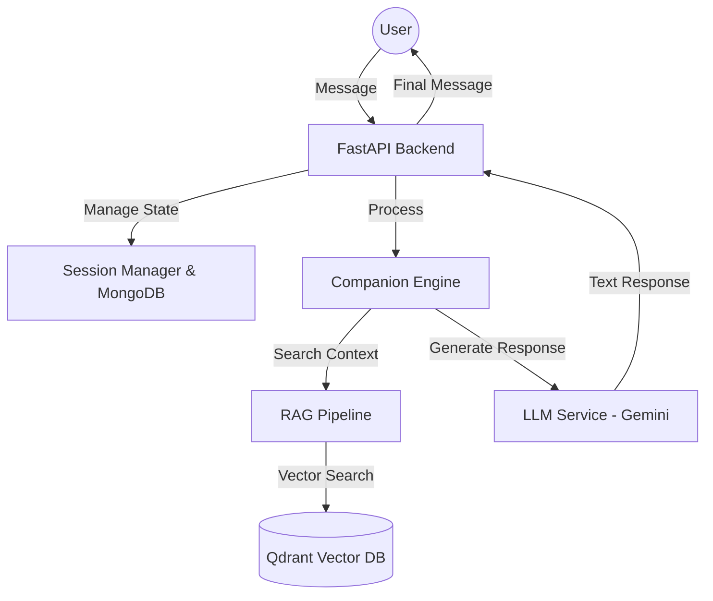
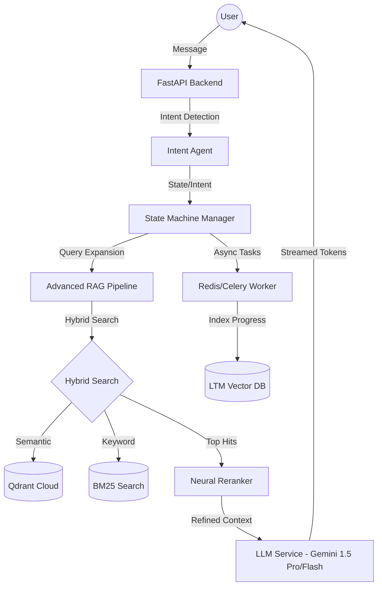

# 3ioNetra: System Flow & Architecture Documentation

This document provides a detailed technical overview of the existing and upgraded flows for the 3ioNetra Spiritual Companion.

---

## 1. Existing System (Current Flow)

The current 3ioNetra system is a functional prototype designed to provide spiritual companionship through empathetic listening and scripture-based guidance.

### 1.1 Core Components

| Component | Description | Primary Technology |
| :--- | :--- | :--- |
| **FastAPI Backend** | The central orchestrator handling API requests, session state, and service coordination. | Python, FastAPI |
| **Companion Engine** | Logic layer that manages conversation phases and assesses user readiness for wisdom. | Custom Logic |
| **LLM Service** | Interfaces with Gemini to generate empathetic responses and spiritual synthesis. | Google Gemini API |
| **RAG Pipeline** | Handles semantic search across processed spiritual scriptures (Gita, Vedas, etc.). | Qdrant (Local), Sentence Transformers |
| **Session Manager** | Manages ephemeral and persistent session states, including user context and signals. | MongoDB, Pydantic |

### 1.2 Existing Architecture

### 1.3 Request Flow (Detailed)

1.  **Input Reception**: The backend receives a message along with a `session_id`.
2.  **Session Retrieval**: The system fetches the current `SessionState` and previous `ConversationMemory` from MongoDB.
3.  **Phase Assessment**:
    *   **Listening Phase**: The bot focuses on empathy and gathering "signals" (emotional state, life domain).
    *   **Guidance Phase**: Triggered after sufficient signals are collected or an explicit "urgent" request is detected (via keyword heuristics).
4.  **RAG Retrieval**: If in the Guidance phase, the engine searches the Vector DB for the top $K$ relevant scripture chunks.
5.  **LLM Generation**: The system prompt (defined in `config.py`) guides Gemini to structure the response into Empathy, Wisdom, Actionable Steps, and Product Recommendations.
6.  **State Update**: The session's `turn_count`, `phase`, and `signals_collected` are updated in MongoDB.

---

## 2. Upgraded System (Service Enhancement Roadmap)

The upgraded flow integrates the **Service Enhancement Roadmap** to transition the bot into a production-grade spiritual guide with higher precision and lower latency.

### 2.1 Key Upgrades & New Components

*   **LLM-Based Intent Agent**: replaces hardcoded keyword matching with a dedicated agent to classify user state (Surrender, Resistance, Seek, Crisis).
*   **Hybrid Search**: Combines semantic vector search with keyword-based BM25 search for precise retrieval of specific spiritual terms.
*   **Neural Reranking**: A secondary stage that scores the top retrieved documents for absolute relevance before they reach the LLM.
*   **Vectorized Long-Term Memory (LTM)**: Past conversations are indexed, allowing for permanent context beyond the current session.
*   **Prompt Modularization**: Dynamic management of instructions outside the core codebase for rapid iteration.

### 2.2 Upgraded Architecture

### 2.3 Enhanced Request Flow

1.  **Intent Classification**: Every message is analyzed by an **Intent Agent** to determine the user's emotional and spiritual posture.
2.  **Dynamic Routing**: A formal **State Machine** manages complex transitions (e.g., reverting to Listening if the user challenges the guidance provided).
3.  **Query Expansion**: The LLM generates multiple search variations (e.g., "how to find peace" -> "attaining shanti").
4.  **Hybrid Retrieval & Reranking**: The system fetches results from both vector and keyword indices, then a **Reranker** selects the most "faithful" documents.
5.  **Parent-Context Synthesis**: The LLM receives the full context surrounding a retrieved chunk for more coherent synthesis.
6.  **Real-Time Streaming**: Responses are streamed to the user token-by-token to eliminate perceived wait times.

### 2.4 Technical Roadmap Summary

| Milestone | Upgrade | Primary Benefit |
| :--- | :--- | :--- |
| **Phase 1** | Hybrid Search + LLM Intent | 90% Retrieval Hit Rate; Nuanced understanding. |
| **Phase 2** | Neural Reranking + Streaming | Higher response accuracy; Zero perceived latency. |
| **Phase 3** | Long-Term Memory (LTM) | True personalized companionship over months/years. |
| **Phase 4** | Panchang & Product API | Real-time spiritual utility and commerce integration. |
